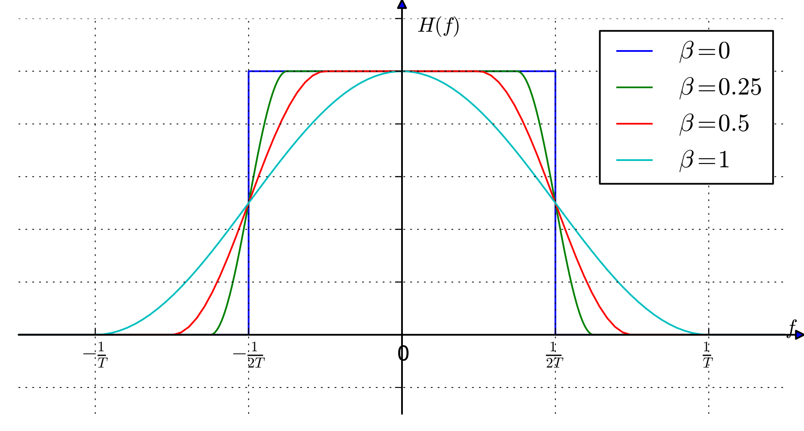
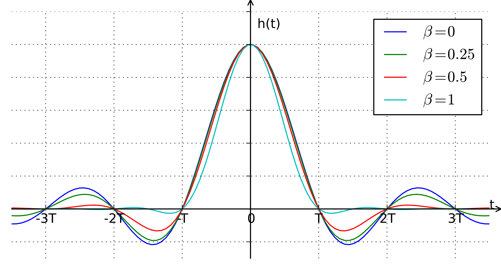

# Cosine Roll-off Filter Description

## Overview

The Cosine Roll-off filter, or [Raised-Cosine-Filter](https://en.wikipedia.org/wiki/Raised-cosine_filter), is widely used in digital communication systems to control the bandwidth of a signal and reduce intersymbol interference (ISI). Its primary purpose is to make the system more robust to timing errors and to optimize the usage of bandwidth.

    <figure>
        
        
        <figcaption>Frequency and Impulse Response of Raised Cosine Filter</figcaption>
    </figure>

## Theoretical Background

### Frequency Domain Behavior

The Raised-Cosine-Filter achieves its roll-off characteristics by smoothly transitioning from the passband to the stopband using a cosine function. This gradual transition helps in minimizing the side lobes in the frequency spectrum, which in turn reduces ISI and bandwidth spillage into adjacent channels.

### Mathematical Representation

The **frequency response** of the Raised Cosine filter in the transition band is defined as:

$$
H(f) = \begin{cases}
 1,
       & |f -f_c| \leq \frac{f_s(1 - \alpha)}{2} \\
 \frac{1}{2}\left[1 + \cos\left(\frac{\pi}{f_s\alpha}\left[|f -f_c| - \frac{f_s(1 - \alpha)}{2}\right]\right)\right],
       & \frac{f_s(1 - \alpha)}{2} < |f -f_c| \leq \frac{f_s(1 + \alpha)}{2} \\
 0,
       & \text{otherwise}
\end{cases}
$$

$$
h(t) = \begin{cases}
\frac{\pi}{4T} \operatorname{sinc}\left(\frac{1}{2\alpha}\right),
       & t = \pm\frac{T}{2\alpha} \\
\frac{1}{T}\operatorname{sinc}\left(\frac{t}{T}\right)\frac{\cos\left(\frac{\pi\alpha t}{T}\right)}{1 - \left(\frac{2\alpha t}{T}\right)^2},
       & \text{otherwise}
\end{cases}
$$

Where:
- $f_c$ is the center frequency.

- $f_s=\frac{1}{T}=\frac{2B}{1+\alpha}$ is the sampling frequency / symbol rate.
- $\alpha$ is the roll-off factor, ranging from 0 to 1, which controls the width of the filter's transition band.

## Characteristics

- **`Df` (Deviation of Center Frequency)**: Adjusts the center frequency from the carrier, typically in GHz.
- **`B` (Bandwidth)**: Nominal bandwidth of the filter. The actual spectral width is affected by the roll-off factor.
- **`alpha` (Roll-off Factor)**: Defines the transition sharpness between the passband and stopband, ranging from 0 (sharp, rectangular) to 1 (gentle, maximal roll-off).
- **`loss`**: Attenuation in dB, representing energy loss due to filtering.